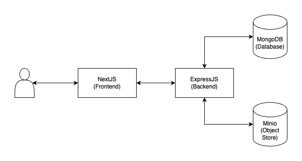

# Audio Files Dashboard

## Overview

The Audio Files Dashboard is a web application designed to manage and categorize various types of audio files.

## System Architecture



## Running locally

The following steps should work on macOS and most Linux distributions with Docker installed.

### Build and run the docker containers

The `build.sh` will build both the frontend and backend docker images.

```sh
chmod +x build.sh

./build.sh
```

The docker-compose file will run the frontend, backend, MinIO Object Storage and MongoDB docker containers.

```sh
docker-compose -f deployment/docker-compose.yml up -d
```

### Accessing the application

The frontend will be hosted on [http://localhost:3001](http://localhost:3001).

A set of admin credentials has been preloaded into the database.

| Username | Password    |
| -------- | ----------- |
| admin    | password123 |

## Backend APIs

Running the above setup locally will host the backend on port 3000.

The detailed API information will be available [http://localhost:3000/api-docs](http://localhost:3000/api-docs).

### Authentication

| Method | Endpoint     | Description                                    |
| ------ | ------------ | ---------------------------------------------- |
| POST   | /auth/login  | Authenticates a user and returns user details. |
| POST   | /auth/logout | Logs out the authenticated user.               |

### Audio

| Method | Endpoint             | Description                           |
| ------ | -------------------- | ------------------------------------- |
| POST   | /audio               | Upload audio file.                    |
| GET    | /audio               | Retrieve a list of all audio files.   |
| GET    | /audio/{id}/stream   | Stream a specific audio file by ID.   |
| GET    | /audio/{id}/download | Download a specific audio file by ID. |
| DELETE | /audio/{id}          | Delete a specific audio file by ID.   |

### Users

| Method | Endpoint    | Description                    |
| ------ | ----------- | ------------------------------ |
| GET    | /users      | Retrieve a list of all users   |
| GET    | /users/{id} | Retrieve a specific user by ID |
| POST   | /users      | Create a new user              |
| PUT    | /users/{id} | Update an existing user        |
| DELETE | /users/{id} | Delete a user                  |
